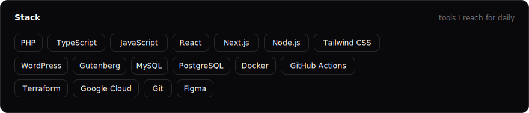
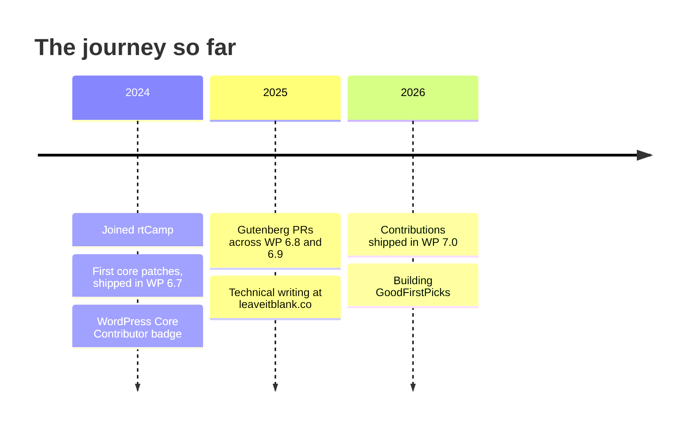

<picture>
  <source media="(prefers-color-scheme: dark)" srcset="assets/hero-dark.svg">
  <source media="(prefers-color-scheme: light)" srcset="assets/hero-light.svg">
  
</picture>

  <a href="https://leaveitblank.co">Blog</a>
  &nbsp;·&nbsp;
  <a href="https://profiles.wordpress.org/mayanktripathi32/">WordPress.org</a>
  &nbsp;·&nbsp;
  <a href="https://in.linkedin.com/in/lib-mayank">LinkedIn</a>
  &nbsp;·&nbsp;
  <a href="mailto:leaveitblank32@gmail.com">Email</a>

 

<picture>
  <source media="(prefers-color-scheme: dark)" srcset="assets/stack-dark.svg">
  <source media="(prefers-color-scheme: light)" srcset="assets/stack-light.svg">
  
</picture>

<picture>
  <source media="(prefers-color-scheme: dark)" srcset="assets/languages-dark.svg">
  <source media="(prefers-color-scheme: light)" srcset="assets/languages-light.svg">
  
</picture>

## At rtCamp

[rtCamp](https://rtcamp.com) builds enterprise WordPress for some of the world's largest publishers and brands. My slice of that:

- **Enterprise publishing platforms** — engineering and maintaining WordPress VIP sites for global newsrooms and media brands
- **Large-scale content migrations** — moving years of editorial archives between platforms with custom CLI tooling, pre-flight checkups, and zero-loss verification
- **Block editor engineering** — custom Gutenberg block suites, full-site editing themes, and editorial workflows that editors actually enjoy using
- **Open source on company time** — my WordPress core and Gutenberg contributions are sponsored by rtCamp as part of its [Five for the Future](https://wordpress.org/five-for-the-future/) pledge

## Open source

WordPress runs over 40% of the web, and I help maintain the editor at the heart of it — 24+ merged PRs in [`WordPress/gutenberg`](https://github.com/WordPress/gutenberg/pulls?q=is%3Apr+author%3AMayank-Tripathi32+is%3Amerged)[^1], spanning table block fixes, component refinements, and REST API hardening.

> [!TIP]
> Want to start contributing to open source but don't know where? I'm building [**GoodFirstPicks**](https://github.com/Mayank-Tripathi32/good-first-picks) — an AI-powered platform for discovering and claiming good first issues.

## Stats

  <picture>
    <source media="(prefers-color-scheme: dark)" srcset="https://github-readme-stats.vercel.app/api?username=Mayank-Tripathi32&show_icons=true&hide=stars&count_private=true&bg_color=09090b&border_color=27272a&title_color=fafafa&text_color=a1a1aa&icon_color=fafafa&ring_color=fafafa&border_radius=12">
    <source media="(prefers-color-scheme: light)" srcset="https://github-readme-stats.vercel.app/api?username=Mayank-Tripathi32&show_icons=true&hide=stars&count_private=true&bg_color=ffffff&border_color=e4e4e7&title_color=09090b&text_color=71717a&icon_color=09090b&ring_color=09090b&border_radius=12">
    
  </picture>
  <picture>
    <source media="(prefers-color-scheme: dark)" srcset="https://streak-stats.demolab.com?user=Mayank-Tripathi32&count_private=true&background=09090b&border=27272a&ring=fafafa&fire=fafafa&currStreakNum=fafafa&sideNums=fafafa&currStreakLabel=a1a1aa&sideLabels=a1a1aa&dates=71717a&border_radius=12">
    <source media="(prefers-color-scheme: light)" srcset="https://streak-stats.demolab.com?user=Mayank-Tripathi32&count_private=true&background=ffffff&border=e4e4e7&ring=09090b&fire=09090b&currStreakNum=09090b&sideNums=09090b&currStreakLabel=71717a&sideLabels=71717a&dates=a1a1aa&border_radius=12">
    
  </picture>

<strong>More about me</strong>

 

- Discovered WordPress while helping improve a comics website — stayed for the block editor
- I write practical deep-dives on WordPress, React, and deployment at [leaveitblank.co](https://leaveitblank.co): Embla carousels, full-site editing responsiveness, PostgreSQL enums, CI/CD pipelines
- Off the clock: online games, music, and experimenting in the kitchen

 

  Always happy to talk WordPress, open source, or web performance — <kbd>⌘</kbd> <kbd>C</kbd> the email above and say hi.

[^1]: Live count, straight from the linked PR search — no marketing rounding.
